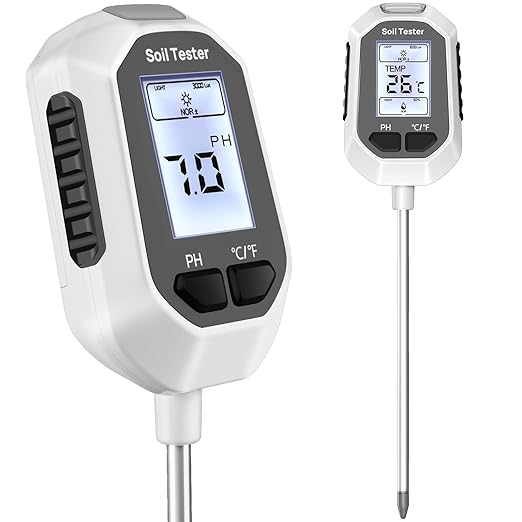
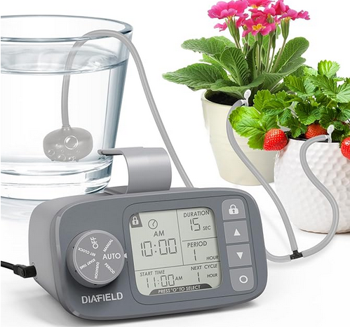
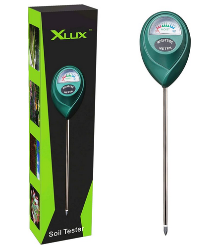

## Voices of the Customers Benchmarking

### Search #1

**Keywords:** "automatic plant light and waterer"

**Search Results Link:** [Amazon.com](https://www.amazon.com/s?k=automatic+plant+light+and+water&crid=3R6578VPZ0PIL&sprefix=automatic+plant+light+and+water%2Caps%2C226&ref=nb_sb_noss)

### Selected Products

1. [Hydroponics Growing System Indoor Garden](https://www.amazon.com/Hydroponics-Growing-System-Indoor-Garden/dp/B0BBN193BK/ref=sr_1_1?crid=1B4AXU6KOLK2E&dib=eyJ2IjoiMSJ9.4vdTQ9-sIwkJDx41WNbXF4yWhnr_XceUM7pSPFPVaHfBO4YpMjhqy3aMDA_Wzl6JWNxiVMQ1Km3kvkakSt5J4oIo8r1jYqd5rPKeV25pTdNUHS7lYd9dZ5Mghy0Xd71BpyRj7IsoyyG5NyaxMRKwqQb1TmOzTyQhIELGt7Lr4fxLanA4TXSkVVBT-ov5qBDkFoOjpVkn5kgL6pmxsAehblDzMQ1EGIaDRmY3GfYMwsjXfa5HsTM-XV-CQh7biDkUgrp3Oekmi8e1RY27Gq4mOpyPuNYS_QcDRWQIkb9_K1w.hxS1k0SgYWXPIXN4eAqw4jRmcqDvCeQqUpHeQWZBLvs&dib_tag=se&keywords=automatic%2Bplant%2Blight%2Band%2Bwater&qid=1757990270&sprefix=automatic%2Bplant%2Blight%2Band%2Bwater%2Caps%2C182&sr=8-1&th=1)

- Price: $59.99 or $35.99 (On sale -40%)
- Vendor: [GARDENCUBE](https://www.amazon.com/stores/GardenCube/page/7FCD375E-B217-4CBE-A621-D35A3A612372?is_byline_deeplink=true&deeplink=BA831E1C-84F1-4A1C-9306-9608880DECCA&redirect_store_id=7FCD375E-B217-4CBE-A621-D35A3A612372&lp_asin=B0BBN193BK&ref_=ast_bln&store_ref=bl_ast_dp_brandLogo_sto)
- Description: 

**HARVEST ANYWHERE & ANYTIME:** Indoor gardening system efficient 24-watt LED grow light simulates optimal effects of sunlight. Technology optimized for plants, herbs garden LED panel can be adjusted to 180° maximum and 21inches maximum height, plants receive more illumination area, maximize photosynthesis, and also more convenient for pruning branch leaves. Hydroponics plants grow 5 times faster than soil, harvest fresh all year round

**QUIET SMART WATERING SYSTEM:** Hydroponic growing system water pump with premium quality ceramic core technology, super quiet (less than 20 dB). The pump runs every 30 minutes, not only efficient and energy-saving but also provides oxygen for better root development. Indoor herb garden designed with the water shortage indicator, don't worry about forgetting to water
SUPER EASY SETUP AND USE: Hydroponics comes with everything you need gardening plant grower germination kit (seeds not included) to start your garden. Automatically controls light on 24-hour cycle (16 hours on, 8 hours off). You just select the veggies or flowers & fruits light mode by buttons on the control panel, plants growth can be observed

**DETACHABLE, EASY TO CLEAN:** LED light pole is detachable to avoid short circuits while cleaning plant lights for indoor growing, and the light pole is adjustable in height to accommodate changing hydroponics growing system indoor gardening plants. 3L large water tank with a see-through water level window, allowing one to know at a glance and add water in time

**INDOOR GARDENING GIFTS AND FUN:** Indoor herb grower garden starter kit comes with 8 pods perfect for you to grow herbs and vegs such as basil, lettuce, rosemary, and tomatoes. These are not only cool things but also healthy and fresh! Ideal gift for family or gardeners and plant lovers, great experiment using hydroponic with your kids

<small><b>POSITIVE COMMENTS</b></small>

| Voice of the customer                                       | Restated Customer Need                           |
|-------------------------------------------------------------|--------------------------------------------------|
| "I purchased this hydroponic growing system, and I am thoroughly impressed with its performance. The system is easy to set up, even for beginners. What really stands out is how quickly my plants started growing. Within just a few weeks, I noticed vibrant, healthy leaves and strong stems. The system circulates water efficiently, which prevents the risk of over-watering and ensures that the plants are getting a consistent supply of nutrients. The environment for plant growth is incredibly controlled, which means I can grow crops all year round, regardless of outdoor weather conditions. There's minimal maintenance required once it's set up, and I haven't had to deal with pests or weeds, making the process hassle-free. Overall, I highly recommend this hydroponic system for anyone looking to grow healthy, vibrant plants." | 1. The system is effective showing tangible results in plant growth  (explicit) |
| | 2. The system has minimal upkeep (explicit) | 
| | 3. The system is not affected by external variables like weather  (latent) |

<small><b>NEGATIVE COMMENTS</b></small>

| Voice of the customer                                       | Restated Customer Need                           |
|-------------------------------------------------------------|--------------------------------------------------|
| "We love this unit but the pump motors keep failing. We have replaced this product twice now through Amazon and now our most recent  replacement is having the same issues. It starts out great right out of the box. We followed the instructions and started growing our own cilantro, parsley, basil, and oregano right away. The produce tastes so amazing that we ended up getting a second unit hoping we would no longer have to buy the items we grow from the grocery store. During weeks 3-4 the pump motors keep failing. They will start off silent but then after about the third week you will start having a noticeable buzzing noise. We have tried everything from trimming the root systems down and also removing the pump and thoroughly cleaning it. Nothing works. It ends up getting so loud that it is unbearable. If they could fix this issue I would give this product 5 stars. Being that I have already replaced two and the third one is now doing the same thing there is definitely a quality issue. For now I will keep replacing them through Amazon as long as they let me. But maybe a pricier unit from another brand might be in store for us down the road." | 1. The systems components must be able to last a long duration and can be easily replaced if needed (explicit) |
| | 2. The system must have a minimal footprint not taking up too much space and not making excessive noise (explicit) | 
| | 3. The systems components need to be durable so they will be in perfect working condition even after an external disturbance (latent) |

### Search #2

**Keywords:** "plant sensor"

**Search Results Link:** [https://www.amazon.com/s?k=plant+sensor&ref=nb_sb_noss](https://www.amazon.com/s?k=plant+sensor&ref=nb_sb_noss)

### Selected Products

1. [4-in-1 Soil Moisture Meter Digital](https://www.amazon.com/Moisture-Temperature-Intensity-Backlight-Gardening/dp/B0DF4TB93J/ref=sr_1_6?dib=eyJ2IjoiMSJ9.N4QdmrOssJrgIWZACcv9MWtC2midTm6U0im0zMMuE-4ffJ3u8YK0i62RGB6SMLglrkS3hlkeCY7gubrw-AZ6_rSlrYMX_eAOTnd5sw2bSNiCpeqzJgv7gNK_4TtPIvdlgNt3LZSd8-S2NC7HLzs_0Fr71im7MH_C7MErKBH16xFzxyFJCiU6PKmhmc4WDe4mZgnp-gv7XqYt8n_Gd1AwQIKLYZqgQxHViv6WWYeuIbCbm9WNHhq8Zk6Kzoyiz1lhSbuFqX9w_vd5DY40HH40tWhMA1qq9_2OFJCGzjVADUo.28z_kVZvqhalNISjmVALK1XU6Whc6kP4pwTLYycL1FU&dib_tag=se&keywords=plant+sensor&qid=1757992357&sr=8-6)

- Price: $32.98
- Vendor: Amazon
- Description: This plant sensor is a 4-in-1 digital soil test meter with a display that measures soil moisture, pH, temperature, and sunlight intensity.

<small><b>POSITIVE COMMENTS</b></small>

| Voice of the customer                                       | Restated Customer Need                           |
|-------------------------------------------------------------|--------------------------------------------------|
| "I am so impressed with this 4-in-1 soil moisture meter! As someone who loves gardening and taking care of indoor plants, this tool has been a total game changer. It’s so easy to use and gives me accurate readings for soil moisture, pH level, sunlight, and temperature — all in one device! Now I finally know exactly when to water and where to place my plants for the best light. The digital screen is clear and easy to read, and I love that it helps me avoid overwatering or underwatering my plants. It’s lightweight, durable, and doesn’t disturb the roots when testing. Since using this meter, my plants have been healthier and happier than ever. If you love your plants and want to make plant care so much easier, this is definitely worth it. Highly recommend!" | 1. The user needs a tool that is straightforward and easy to use (explicit) |
| | 2. The user needs accuracy from readings (explicit) | 
| | 3. The user needs to ensure that their plants are thriving (latent) |
| "Living where it rarely rains this is a must. Knowing how much to water plants and trees can safe me $$$. Knowing the ph of the soil keeps the veggies happy and growing. The length of the probe will let you know what is at the roots of your plant." | 1. The user needs to save money by knowing when to water their plant (explicit) |
| | 2. The user needs a long enough probe to measure at the plants roots (explicit) | 
| | 3. The user needs a way to overcome specific environment challenges, in this case a dry climate (latent) |
| "I am a teacher and do not have a lot of time for garsening, but when summer hits: look out! This gauge is amazing. I am new to gardening and this helps me not over think everything! I live in central Maine, so zone 5; the climate is a little different every growing year, so this takes the guess work out of when to put it all in the ground." | 1. The user needs a tool that helps with gardening in a way that cuts down on time spent (explicit) |
| | 2. The user should feel more confident in their gardening abilities through its use (latent) | 
| | 3. The user needs a way to make informed decisions even in an inconsistent climate (latent) |
| | 4. The user needs a way to reduce overthinking about plant care (explicit) |

<small><b>NEGATIVE COMMENTS</b></small>

| Voice of the customer                                       | Restated Customer Need                           |
|-------------------------------------------------------------|--------------------------------------------------|
| "Cons: - for successful planning of a garden and house plant maintenance, you need to know how many hours of sunlight the plants will get, not just how intense the light is in one single moment in which you take the measurement. This instrument does not provide this information at all (and it's what I needed the most, and what other reviews don't make clear). It would be much improved if it could be left in a spot for few hours to measure the hours of sunlight exposure. Otherwise, the measure of intensity of light is useless for outdoor gardens (without knowing how many hours of that sun the plants will get). Indoor you might need to measure that, but outdoor it's pretty simple (sun intensity varies by season, and sun intensity doesn't measure the hours of sun exposure) - if your PH is fine (neutral, which most plants seem to prefer), you won't need this functionality a lot. You would only need to recheck the soil PH if you actually needed to modify it. Otherwise, if you're using it in your own yard, soil PH has a tendency to stay the same over time (unless of course you are treating the soil to make it more alkaline or acidic) - so the only useful functionality is the measure of moisture (indoor and outdoor use) and temperature (for outdoor plants). - three stars is for not giving the full picture on sun exposure. Plants need water, sun, and quality soil to thrive. Adequate hours of sun, in my experience, make or break the outdoor garden. So it's a crucial piece of information that you won't get from this tool, and you will need to purchase another tool to obtain." | 1. The user needs to measure sunlight exposure over a period of time (explicit) |
| | 2. The user needs ongoing utility, rather than one-time measurements (explicit) | 
| | 3. The user needs data that they consider critical information (latent) |
| | 4. The user needs a single tool that provides all crucial information without needing additional instruments (explicit) |
| "The sale’s information does not indicate this product is really intended for outdoor gardening but is listed under houseplant hygrometers. The product is also not intended to register lux intensity from artificial lighting, but rather only from sunlight. This is not indicated in the sale’s information but clearly stated in the user manual." | 1. The user needs a tool that measures light intensity from artificial and natural light (explicit) |
| | 2. The user needs all critical product information to be clearly stated (explicit) | 
| | 3. The user needs to feel that they are not being misled (latent) | 
| | 4. The user needs a product that solves their problem without needing more searching for something else (latent) | 
| "A Rip-Off. It will tell you if the soil is wet or dry... more or less. If you plan on using this to monitor or even spot-check ph, don't. From the start I noticed that ph readings varied signficantly with the dept of the probe into the soil, from 5.5 down to 3.5. Then it tried to tell me that wood ash is acidic. I checked the readings against results of soil from the same location/depth with the results of a LaMotte and Rapidtest soil test kits. Not even close. It wanted me to believe that a soil which measured around 7.5 was actually acidic, around 4.5. Enough of that, time to return. Please don't expect any different results. I regret that I cannot give this one a 0 for 5 rating." | 1. The user needs a tool that provides precise readings, rather than rough estimates (explicit) |
| | 2. The user needs consistent and verifiable results (explicit) | 
| | 3. The user needs logical and believable data that doesnt contradict their own knowledge (latent) | 
| | 4. The user needs to not feel "riped-off" by something that does not perform its main purposes (latent) | 

### Search #3

**Keywords:** "Plant Sensor"

**Search Results Link:** [Amazon.com](https://www.amazon.com/s?k=plant+sensor&crid=392HF55R82DY&sprefix=%2Caps%2C111&ref=nb_sb_ss_recent_1_0_recent)

### Selected Products

1. [7-in-one Soil Test Kit, Soil Moisture Meter/PH Meter/Sunlight Intensity/Fertility Soil Tester, LCD Display Air & Soil Hygrometer Temperature](https://www.amazon.com/dp/B0FCXTFMJB/ref=sspa_dk_detail_4?pd_rd_i=B0FCXTFMJB&pd_rd_w=dNV6L&content-id=amzn1.sym.30062d3d-2c31-47f3-af26-55177a669bb5&pf_rd_p=30062d3d-2c31-47f3-af26-55177a669bb5&pf_rd_r=XMC5S4CN1HGSJ666HDNZ&pd_rd_wg=lVBd2&pd_rd_r=8bfaf637-efcd-4a56-bb61-307ae4f0c53c&sp_csd=d2lkZ2V0TmFtZT1zcF9kZXRhaWxfdGhlbWF0aWM&th=1)

- Price: $31.99
- Vendor: TryOpen Store
- Description: 

**7 functions,Scientific maintenance:**The soil testing kit is more suitable for beginners, and can help you comprehensively understand the soil conditions of gardens and lawns, solving your confusion. You can adjust soil moisture and pH according to the values, and you can also clearly see the air temperature and humidity as well as soil temperature through the LCD display to improve plant growing conditions in time and scientifically nurture seedlings to help you make your plants flourish.

**Design Patented US & Utility Patented US:**Originate Designed -combined with both soil meter and LCD-display soil/air temperature and humidity meter for plants. This allows you to monitor soil moisture/pH/fertility/sunlight and soil temperature/air humidity and temperature in your garden/house all in one unit. Our soil meter can help you to get a more comprehensive and direct understanding of your plants/ the key information for scientific seedlings,easy to operate and clear reading

**Metal probes, Fast and Accurate:**Our soil tester probes are made of high-quality metal materials, which are more corrosion-resistant than ordinary materials. Moreover, metal materials have high conductivity and sensitivity, greatly improving the speed and accuracy of soil moisture and pH detection and analysis, allowing you to quickly and accurately understand the growth environment of plants.

**Widely Used:**home gardening, rice planting, vegetable planting, potted planting, flower planting, greenhouse planting, soil testing, etc., to meet your needs for soil moisture testing, soil fertility testing, soil pH testing, sunlight intensity testing, air humidity testing, air temperature testing and soil temperature testing.

<small><b>POSITIVE COMMENTS</b></small>

| Voice of the customer                                       | Restated Customer Need                           |
|-------------------------------------------------------------|--------------------------------------------------|
| "I was able to use this item this past weekend with my flowers and part of the garden. The accuracy was great, it was easy to use and relatively inexpensive. I was able to clearly see the results and correct the imbalance in the yard and flowers. This is a really good product and provides speedy results. It appears to be quite durable also. The instructions were clear and quite helpful." | 1. The user needs the product to give accurate and reliable readings so they can confidently adjust their plants and garden. (explicit) |
| "I recently moved to a house with a nice yard for planting, but before doing so, I was in desperate need of this 7-in-1 soil test kit, as it's very practical and easy to use. The best thing about it is that it combines several functions in a single device, measuring moisture, pH, soil fertility, light intensity, and even temperature, all in one tool. It has a clear, easy-to-read display, and the results are quite accurate. It's lightweight, durable, and works immediately without any fuss. I highly recommend it for gardening enthusiasts like me." | 2. The user needs the product to be lightweight, durable, and simple to use so it works right away without hassle. (explicit) | 
| "It's incredibly useful! It not only measures humidity, but also pH, light intensity, and soil fertility—a versatile device. The clear, intuitive LCD display provides easy-to-understand data. Simply insert it into the soil and the results appear in seconds—very convenient. Since using it, I've been able to water and fertilize my plants more scientifically, and they've grown significantly better." | 3. The user needs the product to be durable for repeated outdoor use while still being affordable for everyday gardeners. (latent) |

<small><b>NEGATIVE COMMENTS</b></small>

| Voice of the customer                                       | Restated Customer Need                           |
|-------------------------------------------------------------|--------------------------------------------------|
| "Gently and firmly inserted probe into my yard. Product broke 2 inches into my first reading. Disappointed" | 1. The user needs the probe to be strong and durable enough to withstand normal insertion into soil without breaking. (explicit) |
 "Not happy with purchase. I could not get it to work even after chnaging out the batteries that are provided. I'll give it another try before returning." | 2. The user needs a soil tester that is reliable and functions properly out of the box, with dependable power. (explicit) | 
| "The light meter only recognizes light if I shine a flashlight directly on the sensor" | 3. The user needs a soil tester with a light sensor that accurately detects natural light levels without requiring artificial sources. (latent) |

### Search #4

**Keywords:** "goes here"

**Search Results Link:** [example.com](https://example.com)

### Selected Products

1. [Name of product](https://example.com)

Picture here

- Price: $
- Vendor: 
- Description: 

<small><b>POSITIVE COMMENTS</b></small>

| Voice of the customer                                       | Restated Customer Need                           |
|-------------------------------------------------------------|--------------------------------------------------|
| "What the customer says" | 1. One need (explicit/latent) |
| | 2. Two need (explicit/latent) | 
| | 3. Three need (explicit/latent) |

<small><b>NEGATIVE COMMENTS</b></small>

| Voice of the customer                                       | Restated Customer Need                           |
|-------------------------------------------------------------|--------------------------------------------------|
| "What the customer says" | 1. One need (explicit/latent) |
| | 2. Two need (explicit/latent) | 
| | 3. Three need (explicit/latent) |

## Search #4

Keywords: “plant monitor system”

Search Results Link: [https://www.amazon.com/s?k=plant+monitor+system](https://www.amazon.com/s?k=plant+monitor+system)

Product 1:  [DIAFIELD Indoor Automatic Plant Waterer](https://www.amazon.com/DIAFIELD-Automatic-Watering-Irrigation-Programmable/dp/B0F21NQCY1?dib=eyJ2IjoiMSJ9.97-1v2-xyuaXvaxLaPI4NJqAWLMzomj9gFTVLg721_FIHGKEGG8B8YoKGtDWLvlKMplazlsQCDq_9Gy9az0KRV_P4Vsw4m47rjKJ7mQwHpfB7uYp0L8njtAJBcpjf25orbWpg2SrQGUYZUOP-Zcxh67QOTWq2dK3iG9HiHYK1VJzxyFJCiU6PKmhmc4WDe4m1GvfLvAT4Ys_ldX3rwEk15GyH6tWlCx0yPgOp8_G1pDgsjAUTGsDr6Nft3VIA6_rxNngY6ZmlQdpRO_p5mEloGhMA1qq9_2OFJCGzjVADUo.ePz_lok5aZ4bV9i_CBR_7j3QTmAy0NNL5m7RNU6K6UA&dib_tag=se&keywords=plant%2Bmonitor%2Bsystem&qid=1757990103&sr=8-8&th=1)

Price: $21.79

Vendor: Amazon

Description: 

- Automatic Drip Irrigation Kit: Upgrade your watering routine with our automatic 
watering system, eliminating the need for daily watering hassles and allowing you 
to effortlessly care for your 15 potted plants
- Simple to Assemble: This system comes with a complete set of components for easy 
installation. Cut and customize the water pipes to design an exclusive irrigation 
system tailored to your own preferences
- Easy to Use: Featuring a generous LCD screen, providing you with a quick and 
effortless way to monitor the system's status. With a 30-day programmable timer, 
you can easily control when and how much water your plants receive
- Water-Saving Design: Using watering stakes can save at least 70% water. The 
system waters plants based on preset schedules and water quantities, reducing water 
waste and promoting environmentally-friendly gardening practices
- Ideal for Vacations and Busy Days: Good for vacations and busy workdays, our 
system ensures your plants receive consistent water supply, promoting healthy growth 
even when you are away from home

<small><b>POSITIVE COMMENTS</b></small>

| Voice of the customer                                       | Restated Customer Need                           |
|-------------------------------------------------------------|--------------------------------------------------|
|“Easy to setup, does as it advertised. Save me time.”|Designed for ease of use by the end-user (explicit)| 
| |Fulfills roles advertised to the end-user (explicit)|

| Voice of the customer                                       | Restated Customer Need                           |
|-------------------------------------------------------------|--------------------------------------------------|
|“Easy to setup. Easy to program. Fully installed, programmed and tested for 3 large plants in about 15 minutes. Make sure to make straight 90 degree cuts on tubing and push tubing all the way down on the connecting tees to avoid leaks.”|Designed for ease of use by the end-user (explicit)| 
| |More thorough user instructions to avoid problems (latent)|

| Voice of the customer                                       | Restated Customer Need                           |
|-------------------------------------------------------------|--------------------------------------------------|
|“This worked well, and was fairly easy to set up. It kept my bonsai alive while I was out of town for a week, at least.”|Designed for ease of use by the end-user (explicit)| 
| |Reliable for extended periods of time (latent)|

<small><b>NEGATIVE COMMENTS</b></small>

| Voice of the customer                                       | Restated Customer Need                           |
|-------------------------------------------------------------|--------------------------------------------------|
|“I am so disappointed that this product did not work for me. All the reviews that I had read prior to the purchase had been very good. One day after I had installed the system, I removed the stakes from my plants to test it and to attempt to determine how much water was being distributed to each plant. However, after removing the stakes, 4 of the 7 stakes I used continued to drip although the system had been turned off. I put the 4 dripping stakes in a large pot to allow any potential residual water in the tubing time to empty. 4 hours later, the pot was 2/3 full and each stake continued to drip at a rate of about two drops per second. The only way I could stop the dripping was to disconnect the power and remove the filter from the water source. I contacted the product customer service. Although she was very nice and did confirm that there was residual water in the tubing, she could offer no additional suggestions. I am returning the system.”|Reliable for extended periods of time (latent)|
| |Fulfills roles advertised to the end-user (explicit)|

| Voice of the customer                                       | Restated Customer Need                           |
|-------------------------------------------------------------|--------------------------------------------------|
|“Great idea, returned after reading the directions. Never opened any of the other parts. Not for an 81 year old to setup!”|Designed for ease of use by the end-user (explicit)|

| Voice of the customer                                       | Restated Customer Need                           |
|-------------------------------------------------------------|--------------------------------------------------|
|“It's very hard to get to operate”|Designed for ease of use by the end-user (explicit)|

Product #2: [XLUX Soil Moisture Meter](https://www.amazon.com/XLUX-Soil-Moisture-Sensor-Meter/dp/B014MJ8J2U?dib=eyJ2IjoiMSJ9.97-1v2-xyuaXvaxLaPI4NJqAWLMzomj9gFTVLg721_FIHGKEGG8B8YoKGtDWLvlKMplazlsQCDq_9Gy9az0KRV_P4Vsw4m47rjKJ7mQwHpfB7uYp0L8njtAJBcpjf25orbWpg2SrQGUYZUOP-Zcxh67QOTWq2dK3iG9HiHYK1VJzxyFJCiU6PKmhmc4WDe4m1GvfLvAT4Ys_ldX3rwEk15GyH6tWlCx0yPgOp8_G1pDgsjAUTGsDr6Nft3VIA6_rxNngY6ZmlQdpRO_p5mEloGhMA1qq9_2OFJCGzjVADUo.ePz_lok5aZ4bV9i_CBR_7j3QTmAy0NNL5m7RNU6K6UA&dib_tag=se&keywords=plant%2Bmonitor%2Bsystem&qid=1757990103&sr=8-7&th=1)

Price: $12.99

Vendor: Amazon

Description:

- Accurate Soil Moisture Detection：The XLUX Soil Moisture Meter can tell you if the 
soil deep inside your pot or garden is dry, moist or wet; whereas your eyes and fingers 
can only determine the moisture level of the soil surface.
-Easy-to-Read Large Dial: The large dial is easy to read and includes three zones with 
ten scales, making it very straightforward to understand.
-Immediate Moisture Reading: Insert the probe into the soil, and without waiting, the 
dial will immediately display the moisture level. You can then decide whether your plant 
needs watering based on the measurement. Do not leave this moisture meter in the soil for
 more than 5 minutes, as the metal tip will gradually corrode.
-Less Damage: A single probe causes less damage to plant roots compared to double or 
multiple probes, and when you remove the probe after testing, it won't bring out much soil.
-Usage Precautions: Do not use it to test very hard soil. Do not test water or other liquids. 
After testing, please wipe the probe clean.

<small><b>POSITIVE COMMENTS</b></small>

| Voice of the customer                                       | Restated Customer Need                           |
|-------------------------------------------------------------|--------------------------------------------------|
|"Very useful, works great and I love the long length!! I have another shorter one, but this one is better because of the length. Good value. I dug down with my finger on dry and wet soils and it is accurate.”|Good cost to performance ratio (explicit)|
| |Long length probe for better utility (latent)|

| Voice of the customer                                       | Restated Customer Need                           |
|-------------------------------------------------------------|--------------------------------------------------|
|“This is a great Moisture Meter and I agree with all the positive reviews left on this site. BUT the one thing that should be emphasized is that you need to follow the directions about NOT using it on very dry soil, rocky soil etc, which are very clearly detailed in the handy little KLUX Instructions booklet that come with it. Also you need to wipe it off from soil or dirt as the manufacturer recommends. If not, it will eventually stop working and read "DRY" when it is not! As a result you may find yourself (like I did) ordering a new one every few years because it has stopped working! Meanwhile, f you just gently use fine sandpaper on the tip to clean off the natural oxidation that occurs, it works like new!”|Reliable for extended periods of time (latent)|
| |Fulfills roles advertised to the end-user (explicit)|

| Voice of the customer                                       | Restated Customer Need                           |
|-------------------------------------------------------------|--------------------------------------------------|
|“So glad I got this as it really helps because sometimes you can over water or under water your plants in pots and in the ground. and with the very hot weather we are having at the moment it really helps as don’t want to over water or underwater. The probe is really long so perfect for looking after plants. Great value and great piece of kit. Well worth having.”|Long length probe for better utility (latent)|
| |Good cost to performance ratio (explicit)|

<small><b>NEGATIVE COMMENTS</b></small>

| Voice of the customer                                       | Restated Customer Need                           |
|-------------------------------------------------------------|--------------------------------------------------|
|“Stay Away!! This is a scam!! This product worked pretty well for about three weeks and then just stopped working altogether. They will not allow you to return it after 30 days. I was just past this time period. I only used it for interior plants, so it was treated very gently, and I never left it sitting in soil for a long time. I always cleaned it with a damp paper towel (between plant readings), so that I am not passing the soil from one plant to another. I had to call Amazon and sit on the phone for 20 minutes to get a return because they will not let you return it after 30 days, but it stopped working after 30 days, so you're just kind of stuck. Stay away and go buy a different product. I did not ask for a replacement. I will just be purchasing a different product. Buyer beware.”|Reliable for extended periods of time (latent)|
| |Fulfills roles advertised to the end-user (explicit)|

| Voice of the customer                                       | Restated Customer Need                           |
|-------------------------------------------------------------|--------------------------------------------------|
|“I bought this for 2 house plants and I started using it for my 2 potted tomato plants outside. The tomato plants have very good soil drainage. I would skip a day after watering, and would get a dry reading. So I would water them. Now my tomato plants have root rot. I thought it was do to all the rain we were having. So I moved the plants on to the porch. The other day I could not find the meter and went and bought one in town. The new meter showed wet. Using the past readings from this meter I thought they would need watered. Now I will be lucky if my tomato plants survive. Today I put the meter in water and it said dry. I used the new meter and it said Wet+. Tossing the meter I bought here.”|Reliable for extended periods of time (latent)|
| |Fulfills roles advertised to the end-user (explicit)|
| Voice of the customer                                       | Restated Customer Need                           |
|-------------------------------------------------------------|--------------------------------------------------|
|“This is a moisture meter that does not measure moisture. After a few months of use, it registers all plants as 'dry', regardless of their moisture level. All plants measure the same moisture level. Even on a plant that has been submerged in water for 24 hours, it says it is at the lowest possible moisture reading. Even when submerged in water, it says it is bone dry. You might as well use a chopstick to take a reading as you will get the same utility out of it.”|Reliable for extended periods of time (latent)
| |Fulfills roles advertised to the end-user (explicit)|
