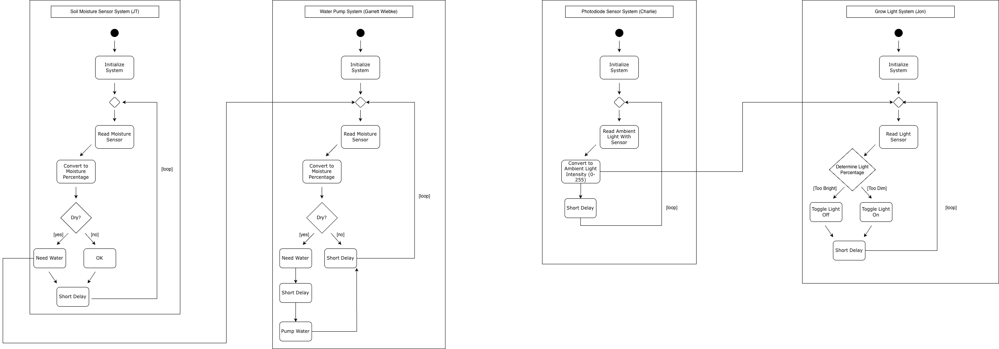

## Introduction

Our team's software design represents a smart plant system that uses multiple sensors and actuators to maintain ideal growing conditions. Each subsystem, soil moisture, light, water pump, and grow light works together to monitor and adjust the environment automatically. The system runs on the Microchip Curiosity Nano, where each board reads, processes, and shares data to coordinate actions.

To prevent constant watering or lighting, the soil moisture and light subsystems include time delays that let the soil dry between cycles and maintain a natural day/night rhythm.

The diagram below shows how each subsystem initializes, collects data, takes action, and loops continuously to keep the system stable.

## Team Activity Diagram

Team Activity Diagram | [PDF Download](softio.pdf) | [Draw.io Download](https://drive.google.com/file/d/14Mvt6AI8rmQZjSnXgR-JArQeQUlvBvEq/view?usp=drive_link)

## Decision Making Process

Our team designed the software structure around four subsystems: a soil moisture sensor, water pump, brightness sensor, and grow light. This approach ensured clear roles, simple debugging, and supported independent subsystem development.

**Key Decisions**

* Divided into four subsystems to separate responsibilities and maintain clarity between team members.

* Used four parallel activity loops to reflect real time behavior where each task runs independently.

* Add initialization steps to each subsystem for consistent startup and reliable operation.

* Time delays for both water and light subsystem to prevent overwatering and continuous light.

* Ensured all subsystems work together to monitor, water, and light the plant efficiently in real time.

