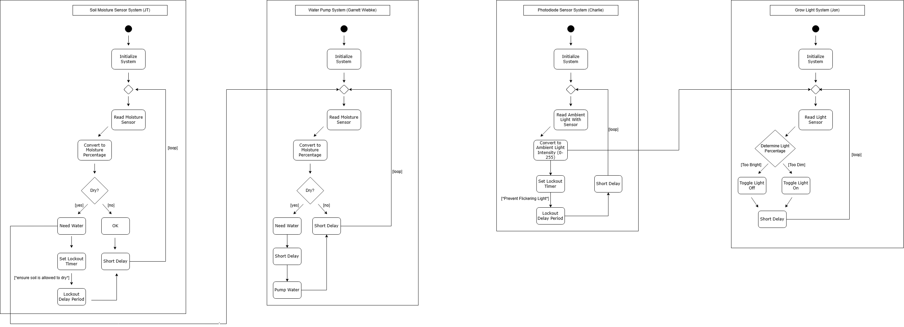

## Introduction

Our teams software design represents a smart plant system that combines multiple sensors and actuators to help maintain ideal growing conditions. Each section is a subsystem, which includes a soil moisture sensor, light sensor, water pump, and grow light, that works together to monitor and adjust the environment automatically. The system operates on the Microchip Curiosity Nano, where each board continuously reads data, processes it, and communicates to each other to coordinate actions.

The diagram below shows how each subsystem initializes, collects data, takes action based on sensor readings and loops continuously to keep the system stable.

## Team Activity Diagram

The schematic as a PDF download is available [*here*](newsoft.pdf)
