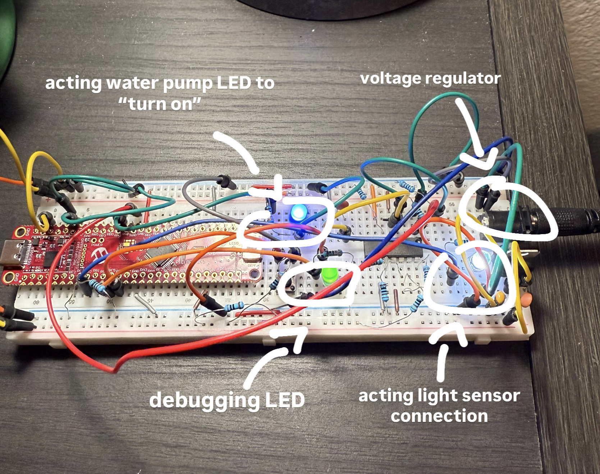

## Soil Moisture Subsystem Cicruit (Breadboard)
  
  Below is a picture of the soil sensor subsystem on a breadboard. It is isolated from any teams system but has leds in place of light sensor and water pump to show functionality.

